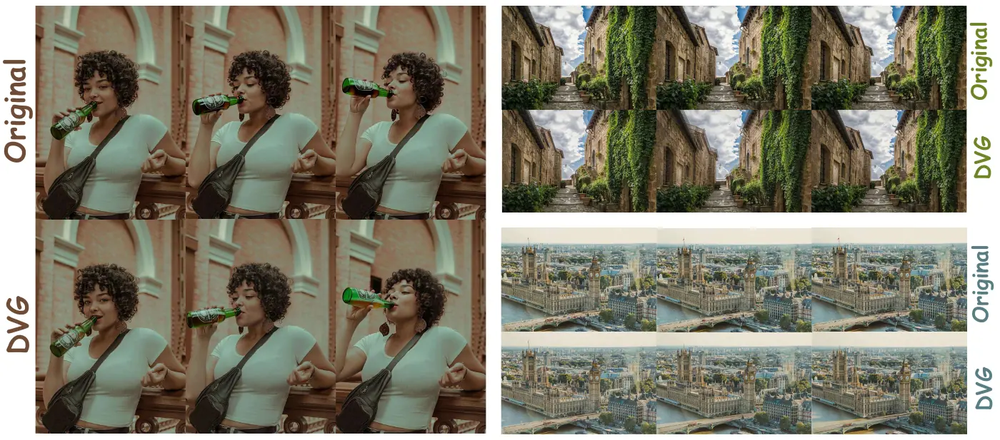
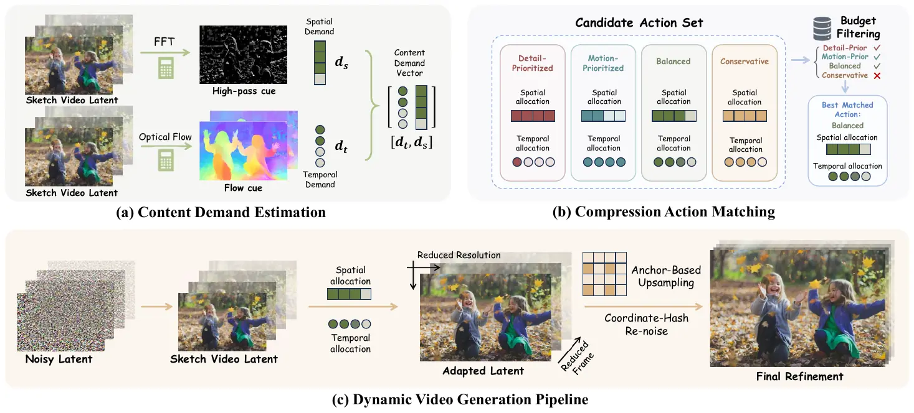

# 🎬 Dynamic Video Generation: Shaping Video Generation Across Time and Space

<p align="center">
  <a href="https://arxiv.org/abs/2605.21042"></a>
</p>

<p align="center">
  <b>Dynamic Video Generation (DVG)</b> is a training-free acceleration framework for diffusion-based video generation.<br>
  It dynamically allocates computation across <b>time</b> and <b>space</b> during sampling, enabling faster generation under a fixed compute budget.
</p>

<p align="center">
  
</p>

## 🎞️ Demo Gallery

### Text-to-Video (T2V)

<p align="center">
  <i>All demos in this section are text-to-video generations.</i>
</p>

<table>
  <tr>
    <td align="center" width="50%">
      
      <br>
      <sub><b>HunyuanVideo</b> · A person is clay pottery making</sub>
    </td>
    <td align="center" width="50%">
      
      <br>
      <sub><b>HunyuanVideo</b> · A horse galloping across an open field</sub>
    </td>
  </tr>
  <tr>
    <td align="center" width="50%">
      
      <br>
      <sub><b>Wan2.2</b> · A zebra and a giraffe</sub>
    </td>
    <td align="center" width="50%">
      
      <br>
      <sub><b>Wan2.2</b> · A cute happy Corgi playing in park, sunset, black and white</sub>
    </td>
  </tr>
</table>

### Image-to-Video (I2V)

<p align="center">
  <i>All I2V demos below are generated with <b>HunyuanVideo-1.5</b>.</i>
</p>

<table>
  <tr>
    <td align="center" width="50%">
      
      <br>
      <sub><b>HunyuanVideo-1.5 (50-step)</b> · A view of a star trail in the night sky</sub>
    </td>
    <td align="center" width="50%">
      
      <br>
      <sub><b>HunyuanVideo-1.5 (50-step)</b> · A view of a waterfall from a distance</sub>
    </td>
  </tr>
  <tr>
    <td align="center" width="50%">
      
      <br>
      <sub><b>HunyuanVideo-1.5 (step-distilled)</b> · A blue fishing boat is navigating in the ocean next to a cruise ship</sub>
    </td>
    <td align="center" width="50%">
      
      <br>
      <sub><b>HunyuanVideo-1.5 (step-distilled)</b> · A view of a snowy mountain side with many buildings</sub>
    </td>
  </tr>
</table>

---

## News


- `2026.05` Paper released on arXiv: [Dynamic Video Generation: Shaping Video Generation Across Time and Space](https://arxiv.org/abs/2605.21042).
- `2026.06` Research codebase organized with DVG integrations for `HunyuanVideo`, `HunyuanVideo-1.5`, and `Wan2.2`.
- 🔥`2026.06` Root README reorganized in a paper-project style.
- `2026.09` Research codebase organized with DVG integrations for `Wan2.1 1.3b`.
- 🎉`2026.09` Our work **Dynamic Video Generation: Shaping Video Generation Across Time and Space** was accepted to **NeurIPS 2026**!


## 🌟 Introduction

Diffusion video generators repeatedly denoise dense spatio-temporal latent grids, which makes inference expensive even when the target motion or spatial detail does not require uniform computation everywhere. Dynamic Video Generation (DVG) addresses this inefficiency with a training-free inference scheme that progressively shapes generation across time and space.

<p align="center">
  
</p>

In this repository, DVG is integrated with four video-generation configurations:

- `HunyuanVideo`
- `HunyuanVideo-1.5`
- `Wan2.1 T2V 1.3B`
- `Wan2.2`

The repository is structured as a research workspace around those backbones, including:

- DVG-integrated inference code
- root-level helper launch scripts
- prompt lists for batched evaluation
- coordinate re-noising caches
- experiment outputs and logs

## ⚙️ Installation

```bash
git clone http://github.com/xxxxx/dynamic-video-gen.git
```

Download TAE checkpoint into `dvg/taehv/weights/` as described in [dvg/taehv/README.md](dvg/taehv/README.md) before running with `ENABLE_TAE=true`.

## 🎥 Inference

### 1️⃣ HunyuanVideo

```bash
export CONDA_ENV_PATH=/path/to/your/conda/env
export MODEL_BASE=/path/to/your/hunyuanvideo/checkpoints
export CUDA_VISIBLE_DEVICES=0
export RESOLUTION=720p
export VIDEO_LENGTH=121
export ENABLE_DVG=true
export DVG_BUDGET=0.5
export ENABLE_TAE=false
bash run_hunyuanvideo.sh
```

Common options:

- `ENABLE_DVG=true|false`
- `DVG_BUDGET=0.5`
- `RESOLUTION=540p|720p`
- `VIDEO_LENGTH=121`
- `ENABLE_TAE=true|false`

### 2️⃣ HunyuanVideo-1.5

```bash
export CONDA_ENV_PATH=/path/to/your/conda/env
export MODEL_PATH=/path/to/your/HunyuanVideo-1.5
export CUDA_VISIBLE_DEVICES=0
export TASK_MODE=t2v        # or i2v
export VIDEO_LENGTH=121
export ENABLE_DVG=true
export DVG_BUDGET=0.5
export ENABLE_STEP_DISTILL=false #12step distill or 50step
export ENABLE_TAE=false

bash run_hunyuanvideo1_5.sh
```

Common options:

- `TASK_MODE=t2v|i2v`
- `ENABLE_DVG=true|false`
- `DVG_BUDGET=0.5`
- `ENABLE_STEP_DISTILL=true|false`
- `ENABLE_TAE=true|false`
- `VIDEO_LENGTH=121`

### 3️⃣ Wan2.2

```bash
export CONDA_ENV_PATH=/path/to/your/conda/env
export MODEL_PATH=/path/to/your/Wan2.2-T2V-A14B
export CUDA_VISIBLE_DEVICES=0,1
export TASK_MODE=t2v        # or i2v
export ULYSSES_SIZE=2   # 2 gpu FSDP
export ENABLE_DVG=true 
export DVG_BUDGET=0.5
export ENABLE_TAE=false

bash run_wan_2_2.sh
```

Common options:

- `CONDA_ENV_PATH=/path/to/your/conda/env`
- `MODEL_PATH=/path/to/your/Wan2.2-T2V-A14B`
- `CUDA_VISIBLE_DEVICES=0,1`
- `TASK_MODE=t2v|i2v`
- `ULYSSES_SIZE=2`
- `ENABLE_DVG=true|false`
- `DVG_BUDGET=0.5`
- `ENABLE_TAE=true|false`


### 4️⃣ Wan2.1 T2V 1.3B

```bash
export CONDA_ENV_PATH=/path/to/your/Wan2.2/conda/env
export MODEL_PATH=/path/to/your/Wan2.1-T2V-1.3B
export CUDA_VISIBLE_DEVICES=0
export ULYSSES_SIZE=1
export ENABLE_DVG=true
export DVG_BUDGET=0.5
export ENABLE_TAE=false

bash run_wan_2_1_1_3b.sh
```

Common options:

- `CONDA_ENV_PATH=/path/to/your/conda/env`
- `MODEL_PATH=/path/to/your/Wan2.1-T2V-1.3B`
- `CUDA_VISIBLE_DEVICES=0`
- `ULYSSES_SIZE=1`
- `ENABLE_DVG=true|false`
- `DVG_BUDGET=0.5`
- `ENABLE_TAE=true|false` (uses the TAE decoder compatible with the Wan2.1 VAE)

## 🙏 Acknowledgements

This repository builds on top of the open-source releases of:

- [Tencent HunyuanVideo](https://github.com/Tencent-Hunyuan/HunyuanVideo)
- [Tencent HunyuanVideo-1.5](https://github.com/Tencent-Hunyuan/HunyuanVideo-1.5)
- [Wan2.2](https://github.com/Wan-Video/Wan2.2)
- [TAEHV](https://github.com/madebyollin/taehv)

We thank the authors of these projects for releasing their code and models.

## 📚 Citation

If you find this repository useful, please cite:

```bibtex
@article{zheng2026dynamic,
  title={Dynamic Video Generation: Shaping Video Generation Across Time and Space},
  author={Zheng, Shikang and Huang, Jingkai and Liu, Jiacheng and Chen, Guantao and Lixuan and Lin, Yuqi and Cai, Peiliang and Zhang, Linfeng},
  journal={arXiv preprint arXiv:2605.21042},
  year={2026}
}
```

## 📄 License

This repository is released under the [MIT License](LICENSE) for the integration code, scripts, and repository-level materials added in this project.

Please note that bundled upstream backbones and model-related components may remain subject to their own original licenses, including:

- `HunyuanVideo/`
- `HunyuanVideo-1.5/`
- `Wan2.2/`
- `taehv/`

Please refer to the license files and model terms provided in those subdirectories before redistribution or downstream use.
